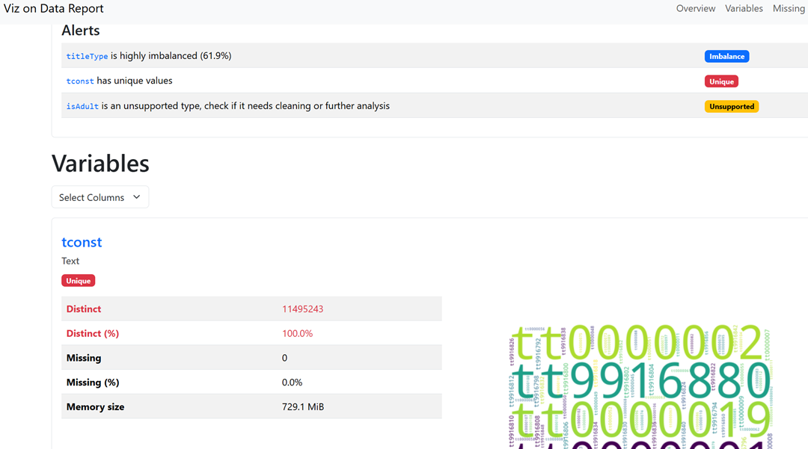
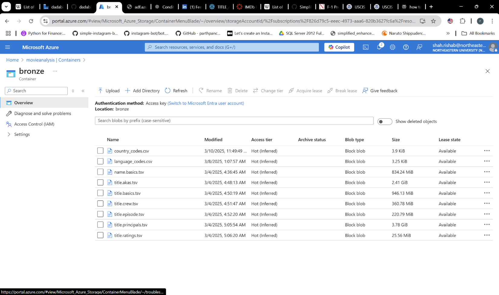
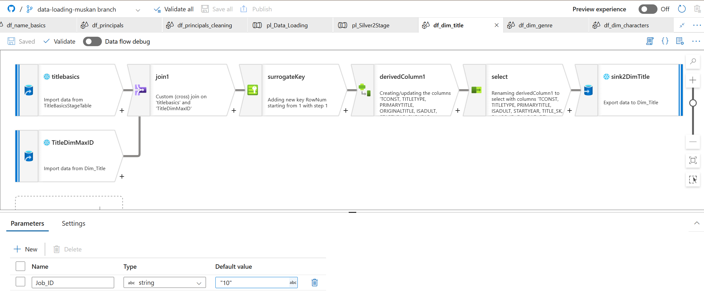
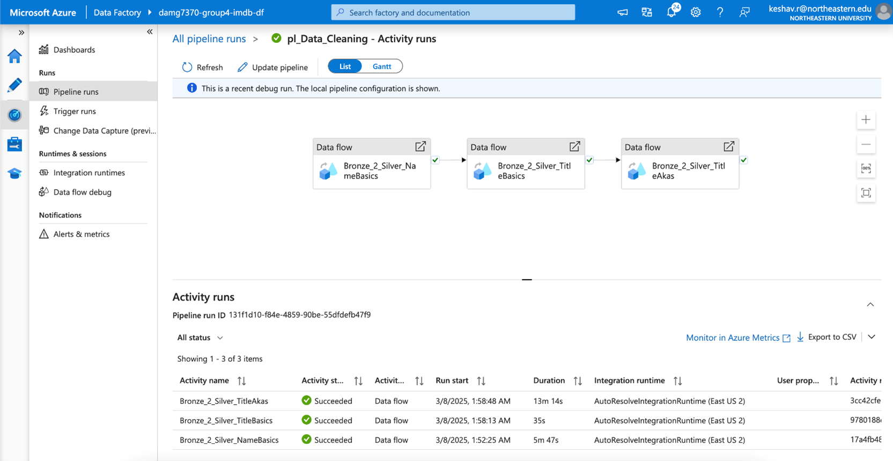
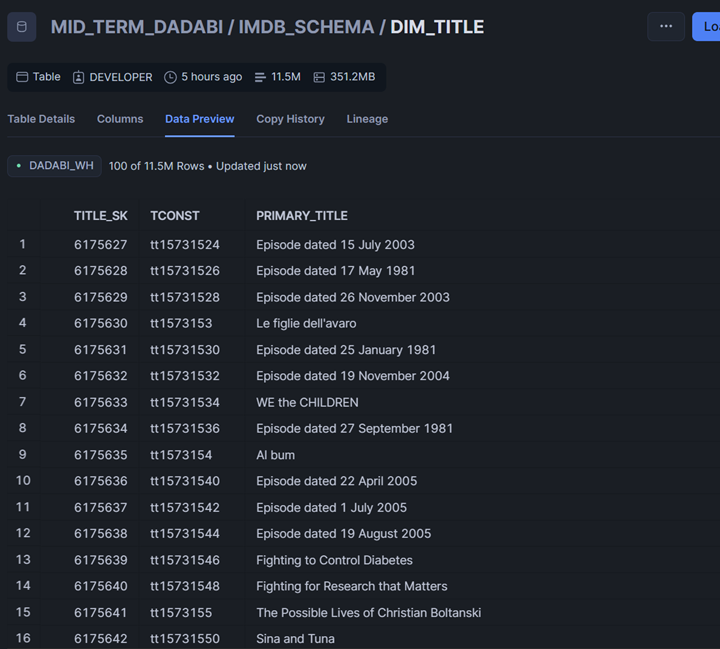

# IMDb BI Pipeline Project

## Overview

This project presents an end-to-end BI solution that transforms IMDb's non-commercial datasets into actionable business insights. The pipeline ingests, profiles, cleans, models, and visualizes over 200 million records using Azure Data Factory, Snowflake, and Tableau, all orchestrated under a medallion architecture. Multi-valued fields are flattened using Snowflake’s `LATERAL FLATTEN`, and key insights are delivered through interactive dashboards and reports.

---

## Technologies Used

---

## Problem Statement

### Challenge

The IMDb dataset is extensive, unstructured, and spread across multiple files with nested or multi-valued fields. Analyzing this data directly for trends in movies, genres, cast, and crew is challenging due to inconsistencies in format and relationships between datasets.

### Solution

To address these challenges, the project implements:
- **Data Profiling** using `ydata-profiling` to assess data quality
- **Schema Design** via ER/Studio to build normalized structures
- **Data Cleaning** through ADF Data Flows for each file
- **Data Flattening** using `LATERAL FLATTEN` in Snowflake for nested fields
- **Medallion Architecture**: 
  - Bronze: raw ingestion using ADF
  - Silver: transformation pipelines and flattening
  - Gold: fact/dimension models with surrogate keys and derived metrics
- **Dashboards** in Tableau to answer business questions on professions, genres, titles, languages, regions, and trends

---

## Data Sources

The dataset was sourced from IMDb's official non-commercial dataset repository:  
🔗 [IMDb Non-Commercial Datasets](https://developer.imdb.com/non-commercial-datasets/)

### The following files were used:
| File Name             | Description                                                                 | Approx. Row Count |
|----------------------|-----------------------------------------------------------------------------|-------------------|
| `name.basics.tsv.gz` | Details about cast and crew members (name, professions, known titles)       | 14,195,120        |
| `title.basics.tsv.gz`| Core title data (title type, primary title, release year, runtime, genres)  | 11,464,895        |
| `title.akas.tsv.gz`  | Title aliases (international titles and translations)                        | 51,409,880        |
| `title.crew.tsv.gz`  | List of directors and writers associated with titles                         | 11,464,885        |
| `title.episode.tsv.gz`| Details about TV series episodes                                            | 8,815,771         |
| `title.principals.tsv.gz` | Key cast and crew per title                                            | 90,984,102        |
| `title.ratings.tsv.gz`| IMDb ratings and number of votes per title                                 | 1,536,010         |

Additional metadata on:
- **Language codes**: ISO 639 standards  
- **Region codes**: IMDb’s official country code listings

---

## Business Requirements

The solution addresses the following business needs:

- Retrieve primary and secondary professions for any individual
- Identify individuals with multiple professions
- List all genres for a given title and retrieve titles by genre
- Filter titles by release year
- Analyze movie runtime trends by year
- Classify titles as adult or non-adult
- Retrieve all languages associated with a title
- Identify regions in which a title was released
- List all directors and writers involved in a title
- Count number of episodes per season for a given series
- Identify types of crew and cast roles (actor, director, writer, etc.)
- Retrieve all jobs and characters involved in a title
- Determine top-rated movies by genre and year
- Build visualizations for:
  - Crew insights (e.g., top actors, directors, backstage roles)
  - Movie ratings trend analysis
  - Series vs. episodes analysis for non-movie content
  - Region and country-based movie release trends

---

## Screenshots

Data Profiling

Bronze Container

Data Flow

Data Pipeline

Data Load
